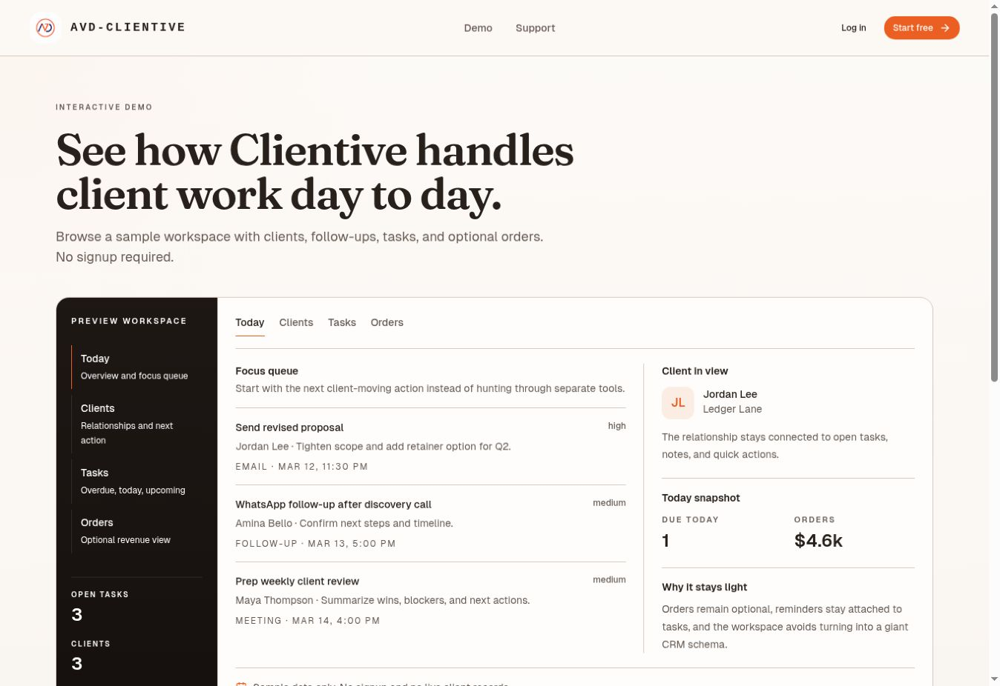

# Clientive

A CRM for solo service businesses that need to keep client notes, follow-ups, tasks, and orders connected. The workspace puts the next action beside the client it belongs to.

[Try the interactive demo](https://avd-clientive.vercel.app/demo) · [Website](https://avd-clientive.vercel.app/)



The public demo uses sample data and requires no account.

## What it does

- Organizes client records with context and next actions.
- Groups tasks into overdue, today, and upcoming work.
- Tracks orders alongside the associated client.
- Provides account access through Supabase Auth.
- Exports task dates to an ICS calendar or a Google Calendar event link.

## Built with

Next.js 15, React 19, TypeScript, Tailwind CSS 3, shadcn/ui, and Supabase.

## Run locally

```bash
git clone https://github.com/andex23/AVD-CLIENTIVE.git
cd AVD-CLIENTIVE
pnpm install
```

Create `.env.local` for an authenticated workspace:

```env
NEXT_PUBLIC_SUPABASE_URL=your_supabase_url
NEXT_PUBLIC_SUPABASE_ANON_KEY=your_supabase_anon_key
SUPABASE_SERVICE_ROLE_KEY=your_server_only_service_role_key
NEXT_PUBLIC_SITE_URL=http://localhost:3000
```

Apply the SQL files in [scripts/sql](scripts/sql) in numeric order to your development Supabase project. Configure its authentication redirect URLs for your local origin.

```bash
pnpm dev
# Production build:
pnpm build
```

Open [localhost:3000/demo](http://localhost:3000/demo) for the sample workspace. Live account and data operations require Supabase; the demo is not proof that those integrations are configured on a deployment.

## Code map

| Path | Purpose |
| --- | --- |
| `app/dashboard/` | Clients, orders, tasks, and settings |
| `app/api/` | Workspace and integration endpoints |
| `components/demo-workspace.tsx` | Public sample workspace |
| `lib/calendar.ts` | Calendar export helpers |
| `scripts/sql/` | Database setup and access policies |

## Project history

The original scaffold was created with v0. This README documents the current application and replaces the generated deployment instructions.
