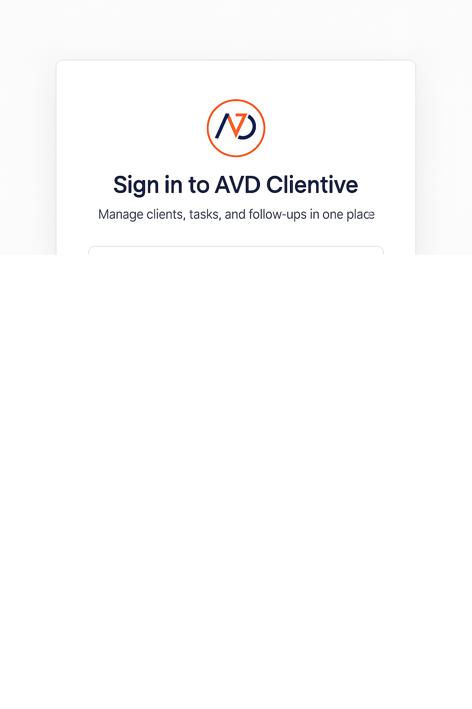

## AVD Clientive — Small Business CRM

Lightweight CRM built with Next.js 15, React 19, Tailwind CSS, and Supabase. Includes clients, orders, and tasks with email support contact.

### Badges
[](https://nextjs.org/)
[](https://react.dev/)
[](https://tailwindcss.com/)
[](https://supabase.com/)
[](https://www.typescriptlang.org/)
[](https://pnpm.io/)

### Features
- Clients, tasks, and orders CRUD (Supabase)
- Auth via Supabase (email/password)
- Dashboard with filters and quick actions
- Support contact form (Resend)

### Requirements
- Node.js 20+ recommended (works on 18 but deprecated by @supabase/supabase-js)
- pnpm (or npm/yarn)
- Supabase project (free tier is fine)
- Optional: Resend account for email

### Quick start
1) Install

```bash
pnpm install
```

2) Configure environment

Create `.env.local` at the repo root:

```bash
NEXT_PUBLIC_SUPABASE_URL=your_supabase_url
NEXT_PUBLIC_SUPABASE_ANON_KEY=your_supabase_anon_key
SUPABASE_URL=your_supabase_url
SUPABASE_SERVICE_ROLE=your_supabase_service_role_key

# Support email (Resend)
RESEND_API_KEY=your_resend_api_key
SUPPORT_INBOX_EMAIL=villamdomum@gmail.com
# Optional: set a verified sender in Resend (recommended)
RESEND_FROM=support@yourdomain.com

# Optional
NEXT_PUBLIC_SITE_URL=http://localhost:3000
```

3) Create database tables in Supabase

- Open Supabase SQL Editor and run the scripts in `scripts/sql/` in order:
  - `001_create_tables.sql`
  - `002_add_email_notify.sql` (adds task email notification flag)

4) Run the app

```bash
pnpm dev
# Local: http://localhost:3000
```

### Health checks
- `GET /api/integrations/health` — verifies Supabase and optional services
- `GET /api/supabase/health` — basic Supabase env presence

### Support contact (email)
- Endpoint: `POST /api/support`
- Requires `RESEND_API_KEY` and `SUPPORT_INBOX_EMAIL`.
- Optional: `RESEND_FROM` set to a verified sender in Resend for best deliverability.

### Production build

```bash
pnpm build
pnpm start
```

### Deployment
- Vercel recommended. Set the same environment variables in your Vercel project.
- Ensure Node.js 20+ runtime for best compatibility with Supabase SDK.

### Tech stack
- Next.js 15 (App Router)
- React 19
- Tailwind CSS
- Supabase (Postgres + Auth)
- Resend (email)

### Screenshots

Dashboard and features overview:


Auth flow (sign-in):



